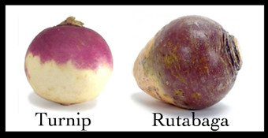

# Rutabaga



[Turnip](https://github.com/jnicklas/turnip) hacks to enable running turnips from inside spec files, rather than outside.

Rutabaga allows you to invert the control of feature files, so that features are called from your `_spec.rb` files rather than the other way around. Step definitions are then put into the `_spec.rb` files as well. The steps are then scoped to that particular test.

This means that it is simple to create tests that are described by a class (such as controller tests in rspec-rails).

[](https://travis-ci.org/simplybusiness/rutabaga)
[](https://badge.fury.io/rb/rutabaga)

## Installation

Install the gem

```
gem install rutabaga
```

Or add it to your Gemfile and run `bundle`.

```ruby
group :test do
  gem "rutabaga"
end
```

Now edit the `.rspec` file in your project directory (create it if doesn't
exist), and add the following:

```
-r rutabaga
```

Add the follwing lines to the bottom of your `spec_helper.rb` (assuming you want to use Capybara and the final one if you wish to have step definitions outside of your spec files:

```ruby
require 'turnip/capybara'
Dir.glob("spec/features/step_definitions/**/*_steps.rb") { |f| load f, true }
```

In order to get `rake` or `bundle exec rake` to work properly, you might need to add this in the file `lib/tasks/rspec.rake` (at least for rails)

```ruby
if defined? RSpec # otherwise fails on non-live environments
  desc "Run all specs/features in spec directory"
  RSpec::Core::RakeTask.new(:spec => 'db:test:prepare') do |t|
    t.pattern = './spec/{**/*_spec.rb,features/**/*.feature}'
  end
end
```

## Usage

### Running a feature file from a spec file

If you create a file `spec/controllers/test_feature_spec.rb` and add:

```ruby
feature "should run feature" do

end
```

Rutabaga will run `spec/controllers/test_feature.feature`.

Features are found either with the same name as the spec file, or as specified by the feature `feature "relative_from_root/path/to/feature/file.feature"`. So, if you have:

`spec/controllers/feature_test_spec.rb`

Then the feature will be:

`spec/controllers/feature_test.feature`

Alternatively, if the feature is specified in the `feature`, that takes precedence:

```ruby
feature "spec/features/test.feature" do

end
```

Path can also be relative to the spec location so:

```ruby
feature "test.feature" do

end
```

Will run `spec/controllers/test.feature`.

**Note** Anywhere that a `.feature` extension can be used, a `.rutabaga` extension is also valid.

### Definining steps

Steps are defined in the same way as in Turnip, however, steps can be defined within the rspec context and are scoped to only be available there.

```ruby
feature "step will only be in this context" do

  step "action :named" do |named| do
    expect(named).to eq("a name")
  end
end

feature "step 'action :named' is not available here" do

  # missing step will cause tests to be marked as pending"
end
```

### Differences from Turnip

Other than these differences, Rutabaga is a tiny shim over Turnip and all features will work as expected.

* Turnip looks anywhere below the `spec` directory for `.feature` files. Rutabaga will only load `.feature` files from below the `spec/features` directory in the old way. This avoids conflicts with `.feature` files that are loaded from `_spec.rb` files.

## Why?

* Document business rules in Gherkin/Turnip/Cucumber human readable language
* Test those rules whereever/however appropriate (not just through Capybara/black box)
* Use the full power of RSpec (so being able to describe a class and then test it)

The most important functionality in a system is the business rules. These range from what appears on a page, to complex rules around when emails should be sent to who. For example, we've written Gherkin tests to test premium changes when a customer changes their insurance coverage.

These rules are often implemented in a Model, a lib class, or some other specific class in the system, especially if the application is well modularized.

In any case, business rules are usually implemented somewhere inside a class tested by a unit test. Those business rules should be tested in Cucumber/Turnip without having to go through the whole system, and without having to have duplicate tests, one inside rspec and another inside features.

The goal is to test just the business rule, in Rutabaga, and not the login, the html, the steps to get there, etc. That way, when the rule changes, only the feature, the test code and the class in question need to change. The test is not affected by wider ranging changes, and is therefore less brittle. The features run at the unit code level, but are acceptance tests.

## Notes/Issues

1. Capybara's rspec extension also redefines feature, so rutabaga will block capaybara's feature example groups
   from working.

## Contributing

1. Fork it
2. Create your feature branch (`git checkout -b my-new-feature`)
3. Commit your changes (`git commit -am 'Added some feature'`)
4. Push to the branch (`git push origin my-new-feature`)
5. Create new Pull Request

## For maintainers

Use `gem-release` to maintain versions https://github.com/svenfuchs/gem-release.

## Testing alternate versions

Put the following (example in a `Gemfile_for_xxx`) to test other versions of gems.

```
# Use global Gemfile and customize
eval(IO.read('Gemfile'), binding)

gem 'turnip', '1.3.1'
```

## Copyright

Copyright © 2012-2016 Simply Business. See LICENSE for details.
